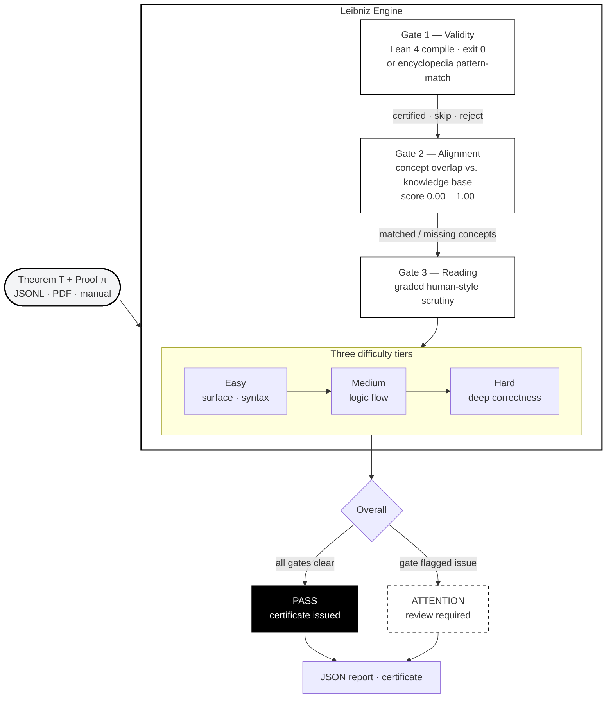
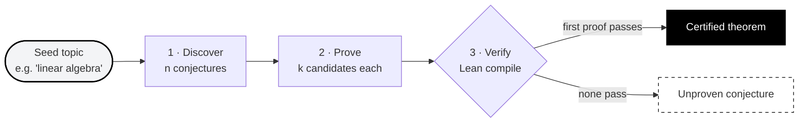

<p align="center">
  
  
  
  
  
  
</p>

<h1 align="center" style="font-weight:800;letter-spacing:-1px;">Leibniz</h1>

<p align="center"><em>A Universal Calculator for Truth</em></p>

<p align="center">
  Automated mathematical proof verification — three escalating gates of scrutiny<br>
  powered by a formal verification engine, a knowledge base of certified theorems, and a language model.
</p>

<p align="center">
  <a href="https://leibniz.streamlit.app/">Streamlit App</a> &nbsp;·&nbsp;
  <a href="https://twomathematicians-code.github.io/leibniz/">Browser Demo</a> &nbsp;·&nbsp;
  <a href="#overview">Overview</a> &nbsp;·&nbsp;
  <a href="#quick-start">Quick Start</a> &nbsp;·&nbsp;
  <a href="#mathematical-domains">Domains</a> &nbsp;·&nbsp;
  <a href="#how-it-works">How It Works</a>
</p>

---

## ◈ OVERVIEW

Given a mathematical theorem $T$ and a candidate proof $\pi$, the Leibniz engine subjects $(T,\, \pi)$ to **three independent gates**:

| Gate | Question | Mechanism |
|------|----------|-----------|
| **Validity** | *Is $\pi$ logically sound?* | Lean 4 type‑check (exit‑0 = certified) or encyclopedia pattern‑match |
| **Alignment** | *Does $\pi$ address $T$'s concepts?* | Concept‑overlap score $\in [0, 1]$ against the knowledge‑base entry for $T$'s domain |
| **Reading** | *How does $\pi$ hold up under human‑style scrutiny?* | Three graded tiers — easy, medium, hard — each returning a verdict and critique |

A proof **passes** only when it clears all three gates. The engine also runs in **discovery mode**: seed a topic → propose conjectures → generate candidate proofs → certify the first that compiles.

**Verdict indicators** &nbsp; `●` pass &nbsp; `◐` skip / provisional &nbsp; `○` reject

---

## ◈ QUICK START

```bash
git clone https://github.com/twomathematicians-code/leibniz.git
cd leibniz
pip install -r requirements.txt

# Streamlit app (recommended) — http://localhost:8501
streamlit run streamlit_app.py

# Command-line demo
python scripts/demo.py --seed "linear algebra"

# API server — http://localhost:8430/docs
python -m uvicorn api.main:app --port 8430

# Run tests
PYTHONPATH=. pytest tests -q
```

---

## ◈ MATHEMATICAL DOMAINS

The encyclopedia ships with certified theorems across five domains. Each entry includes an informal statement, a Lean 4 formalisation, and a verified proof.

### Linear Algebra $(12)$

Vector‑space axioms on $\mathbb{R}^n$ (pointwise): commutativity, associativity, distributivity of scalar multiplication, unity law, additive inverses, eigenvalue of the identity map.

| Theorem | Statement | Tier |
|---------|-----------|------|
| `add_comm_vec` | $\mathbf{v} + \mathbf{w} = \mathbf{w} + \mathbf{v}$ | easy |
| `add_assoc_vec` | $(\mathbf{u}+\mathbf{v})+\mathbf{w} = \mathbf{u}+(\mathbf{v}+\mathbf{w})$ | easy |
| `zero_add_vec` | $\mathbf{0} + \mathbf{v} = \mathbf{v}$ | easy |
| `add_neg_vec` | $\mathbf{v} + (-\mathbf{v}) = \mathbf{0}$ | easy |
| `smul_add_vec` | $c(\mathbf{v}+\mathbf{w}) = c\mathbf{v} + c\mathbf{w}$ | medium |
| `add_smul_vec` | $(c+d)\mathbf{v} = c\mathbf{v} + d\mathbf{v}$ | medium |
| `smul_assoc_vec` | $c(d\mathbf{v}) = (cd)\mathbf{v}$ | medium |
| `one_smul_vec` | $1\cdot\mathbf{v} = \mathbf{v}$ | easy |
| `eigenvalue_id` | $\mathrm{id}(\mathbf{v}) = 1\cdot\mathbf{v}$ for $\mathbf{v}\neq\mathbf{0}$ | medium |
| `linear_combination_zero`* | $a\mathbf{v}+b\mathbf{w}=0,\ a,b\neq0 \implies \mathbf{v},\mathbf{w}$ dependent | hard |
| `determinant_2x2`* | $\det\begin{pmatrix}a&b\\c&d\end{pmatrix}=ad-bc$ | hard |
| `basis_standard_rn`* | $\mathbb{R}^n$ has the standard basis $\{\mathbf{e}_1,\dots,\mathbf{e}_n\}$ | hard |

> *Marked entries are **discovery targets** — stated in the encyclopedia but awaiting a full formal proof.

### Arithmetic $(9)$

Natural‑number identities: $2+2=4$, $3\times3=9$, $10-4=6$, $20/4=5$, $12\%5=2$, $2^5=32$, $3^3=27$, $100-99=1$, $0+0=0$.

### Algebra $(9)$

Identities and structural laws over $\mathbb{N}$: $n+0=n$, $n\cdot0=0$, $n\cdot1=n$, commutativity and associativity of $+$ and $\times$, $\mathrm{succ}(n)=n+1$, $a+a=2a$, cancellation.

### Number Theory $(4)$

Divisibility, primes, and parity: $1\mid a$, $a\mid a$, evenness of zero, squared even is divisible by four. Discovery targets: infinitude of primes, Fermat's little theorem, Bertrand's postulate.

### Order / Set Theory $(4)$

$0<1$, $0\leq1$, $\mathrm{succ}(n)>0$, $n\leq n+1$, $n\leq n$; $S\cup S=S$ (idempotence of union).

### Analytic Number Theory $(1)$

Riemann Hypothesis — critical‑line zeros (domain connector to the companion RH toolkit).

---

## ◈ EXAMPLES &amp; COUNTER‑EXAMPLES

The engine distinguishes between valid proofs, misaligned proofs, and outright failures. Below are examples users can paste directly into the Streamlit / Gradio app.

### ● Valid — passes all 3 gates

| Theorem | Proof | Gates |
|---------|-------|-------|
| `add_comm_vec` | `by ext i; exact add_comm (v i) (w i)` | ● ● ● |
| `two_plus_two` | `by rfl` | ● ● ● |
| `add_comm_nat` | `by rw [Nat.add_comm]` | ● ● ● |

### ○ Counter‑example — fails Gate 1 (Validity)

| Theorem | Proof | Failure |
|---------|-------|---------|
| `two_plus_two` | `by sorry` | `sorry` is an admitted, unproven goal — Lean rejects it |
| `add_comm_vec` | `by not_a_tactic` | Unknown identifier — the proof does not parse |

### ◐ Counter‑example — fails Gate 2 (Alignment)

| Theorem | Proof | Failure |
|---------|-------|---------|
| `add_comm_vec` | `by rw [Nat.add_comm]` | Uses $\mathbb{N}$ commutativity on $\mathbb{R}^n$ — concept mismatch (score $<0.5$) |

### ◐ Counter‑example — warns Gate 3 (Reading)

| Theorem | Proof | Failure |
|---------|-------|---------|
| `infinitude_of_primes` | `by trivial` | Surface syntax passes, but `trivial` cannot prove Euclid's theorem — the deep‑reading tier flags it |

---

## ◈ UPLOAD FORMATS

The Streamlit and Gradio apps accept theorems for batch verification in two formats:

### JSONL (recommended)

```json
{"name":"add_comm_vec","lean_statement":"theorem add_comm_vec (v w : Fin n → ℝ) : v + w = w + v","lean_proof":"by ext i; exact add_comm (v i) (w i)","domain":"linear_algebra","difficulty":"easy","keywords":["vector","addition","commutativity"],"informal":"v + w = w + v"}
```

### PDF

Upload a PDF containing LaTeX‑formatted or plain‑text theorems. The engine extracts text and attempts to parse theorem–proof pairs. Best for research notes, lecture slides, or problem sets.

---

## ◈ HOW IT WORKS

> **[→ Open the interactive workflow diagram](https://twomathematicians-code.github.io/leibniz/workflow.html)** — three animated views: Review, Discovery, Full System.

### Review Mode — 3-Gate Proof Verification



### Discovery Mode — Discover → Prove → Certify



| Path | Description |
|------|-------------|
| **Review mode** | Submit a theorem + proof → 3‑gate verdict |
| **Discovery mode** | Seed a topic → Discover conjectures → Prove (k candidates) → Verify (Lean) |
| **Knowledge base** | 24 encyclopedia entries provide ground‑truth for Gate 2 &amp; provisional Gate 1 |

---

## ◈ ARCHITECTURE

```
leibniz/
├── streamlit_app.py            Streamlit deployment (PDF + JSONL upload)
├── leibniz/                    Python engine
│   ├── core/types.py           Theorem · Proof · GateReport (11 types)
│   ├── llm/backend.py          Stub │ HF │ Remote model backends
│   ├── stages/                 discover · prove · verify · align · read
│   ├── formal/lean_client.py   Lean 4 CLI bridge
│   ├── encyclopedia/           24-entry knowledge base + search
│   └── pipeline.py             Orchestrator
├── api/                        FastAPI host (Render / Fly.io)
├── app/                        Gradio app + sample datasets
│   └── samples/                15‑theorem Linear Algebra JSONL
├── docs/index.html             Browser proof‑checker playground
├── lean/                       Lean 4 library (16 theorems, no sorry)
├── training/                   SFT fine‑tuning framework (44‑pair corpus)
└── tests/                      53 tests
```

---

## ◈ DEPLOY

| Surface | URL | Host |
|---------|-----|------|
| **Streamlit Cloud** | [leibniz.streamlit.app](https://leibniz.streamlit.app/) | Free — live |
| **Browser playground** | [twomathematicians-code.github.io/leibniz](https://twomathematicians-code.github.io/leibniz/) | GitHub Pages — live |
| **HF Space** | Copy `app/` to a new Space | Free CPU |
| **API host** | `docker build -f api/Dockerfile .` | Render / Fly.io |

---

## ◈ INSPIRATIONS

- **Tudor Achim** — *The Path to Mathematical Superintelligence* (TED)
- **G. W. Leibniz** — *De Arte Combinatoria* (1666) and the *characteristica universalis*
- **D. Loeffler &amp; M. Stoll** — *Formalizing Zeta and L‑Functions in Lean* (2025)
- **T. Tao** — On formal proof assistants and the future of mathematical discovery

---

<p align="center">
  <em>"If we had an exact language … by means of which ideas could be reduced<br>
  to a kind of alphabet of human thoughts, then one could, in disputation,<br>
  simply say: <strong>Let us calculate!</strong>"</em><br>
  <sub>— Gottfried Wilhelm Leibniz, 1677</sub>
</p>

<p align="center">
  <sub>Two Mathematicians &nbsp;·&nbsp; <a href="https://github.com/twomathematicians-code/leibniz">GitHub</a> &nbsp;·&nbsp; <a href="https://leibniz.streamlit.app/">Streamlit</a> &nbsp;·&nbsp; MIT License</sub>
</p>
